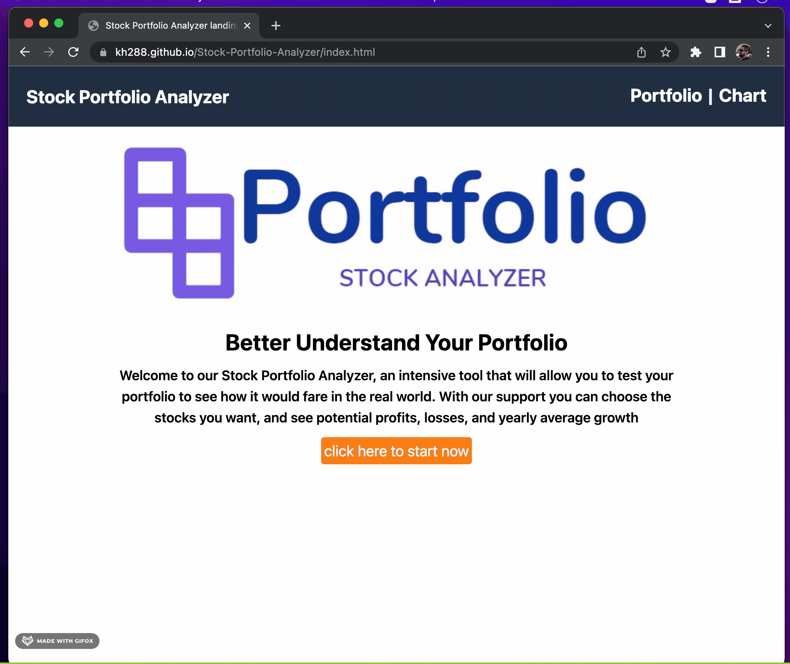

# Stock Portfolio Analyzer

## Introduction

Hello! this is our portfolio analyzer. In this app you get to build a stock portfolio with our potfolio page, this lets you pick as many positions as you want. With this you can then save it into into local storage and navigate to the chart tab to see additional stats and visualize the progress that stock has gained (or lost) over a year's time.

## Table of Contents
* [Description](#description)
* [Features](#features)
* [Technologies Used](#technologies-used)
* [Future Work](#future-work)
* [Authors](#authors)
* [License](#license)

## Description
We're using a couple of cool technologies here to make this possible. This consists of us taking data from Alpha Advantage API to visualize and get the main ticker data. From there we can take that data and plug it into the Portfolio Optimizer API data to get some cool stats: Position Return, Volitility, and Sharpe Ratio.

## Features
<ul>
<li>Create a portfolio</li>
<li>View your positions</li>
<li>View a chart of the stocks you've chosen</li>
<li>See stock stats on the selected stock</li>
<li>Responsive design, each page is mobile friendly for different window sizes</li>
</ul>

## Technology
<ul>
<li>HTML, CSS, Javascript</li>
<li>Chart.js</li>
<li>Alpha Advantage API</li>
<li>Portfolio Optimizer API</li>
<li>jQuery</li>
<li>Tailwind CSS</li>
</ul>

## Authors
* [Richard Ferry](https://github.com/rich-f-p)
* [Kevin Hernandez](https://github.com/kh288)
* [John Netzel](https://github.com/CommieDog)

## License
&copy; 2022 Richard Ferry, Kevin Hernandez, and John Netzel. All Rights Reserved. Licensed under the [MIT License](/LICENSE).